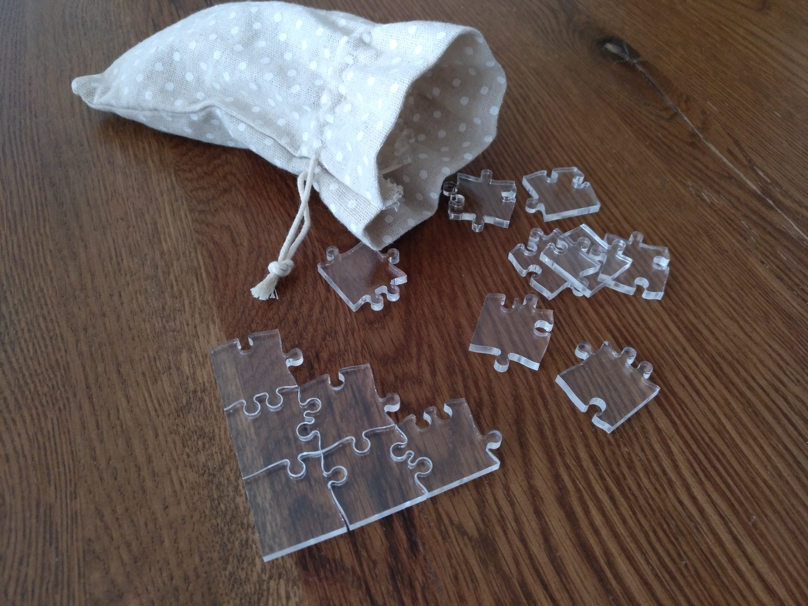
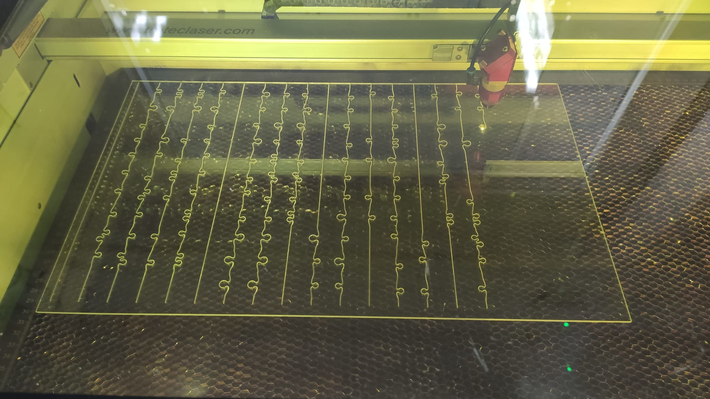

# Jigsaw generator

This is a small experiment where jigsaw puzzles are randomly generated.

We focus on regular grids, where all pieces are squares of the same size.
A piece has 4 edges, selected from a small set of shapes, namely edge types.
By design, adjacent pieces must have complementary edge types.
Having only a few edge types increases the combinations, as more pieces can connect together.

Moreover, the goal is to make apictoral jigsaw puzzles out of transparent acrylic.
This means that front and back faces cannot be distinguished by looking at the piece.
In practice, this not only increases the number of combinations, it also requires a different intuition from usual puzzles.

The main design constraint is to have exactly one solution, if we ignore the rotation and flip of the whole board.
This property opens various strategies, as well as making the problem well defined (i.e. you search THE solution).
However, proving that there is a single solution is likely to be NP-hard.
Hence, the approach here is to brute force all combinations, effectively counting them.

## Getting started

First of all, this project is meant as an experiment, and is therefore not expected to be flexible, nor robust.
Still, feel free to play with the provided helpers!

In this project, jigsaw puzzles are 2D grids of square pieces, where edges belong to a finite (and typically small) set.
While the helpers are typically agnostic about the actual shape of the edge types, this discussion will assume that the definitions from `jigsaw.default` are used.
This provides a definition for `opposite` and `flip`, the two operations required to infer how edges can connect.

Currently, low-level functions are provided, in order to manipulate 2D grids.
There are two main representations, depending on the context:

 * __Edge-wise__, referred as _grid_, which is a pair of 2D arrays, representing horizontal and vertical edges, of shape H x (W + 1) and (H + 1) x W, respectively.
 * __Piece-wise__, referred as _pieces_, which is a single 3D array, representing a 2D array of pieces, of shape H x W x 4.

While the former has the advantage of not duplicating any information (and therefore should be usually preferred), the latter is used during the search, as pieces are manipulated explicitly.
A basic usage is showcased in [`getting_started.ipynb`](getting_started.ipynb).

A more scalable approach is provided in [`attempt_01.ipynb`](attempt_01.ipynb); as the name implies, this is not well-tested, but it has proved sufficient until now.
The overall flow is as follow:

 1. Define a sampler, which is a parameter-less functor that will return a new random grid.
 2. Optionally define custom validators; usually if this is easier to implement a rule as a test instead of a sampling strategy.
 3. Search for a sample that is successfully validated.
    The uniqueness of the solution is usually the last validator to be applied.

The number of solution roughly depends on the ratio of the number of edge types and the number of pieces.
On the one hand, if there are too many edge types, then there is almost surely a single (and often easy) solution.
On the other hand, if there are too few edge types, then there are almost surely many solutions; if uniqueness is requested, this will not converge.

I believe there is no bulletproof strategy here, finding the right balance is trial-and-error.
The key challenge is to make a puzzle that is enjoyable, and not just pure brute-force.
Remembering which combinations of pieces have been tested may very well be a nightmare, so be sure to add a "strategy" in your design.

## Attempts

Here are the provided design attempts.

  
01.01 &mdash; 3x3 basic

  

  
01.02 &mdash; 3x3

  

  
01.03 &mdash; 3x3 skewed

  

  
01.04 &mdash; 3x3 skewed

  

  
01.05 &mdash; 4x4

  

  
01.06 &mdash; 4x4 twisted

  

  
01.07 &mdash; 4x4 with 8 corners

  

  
01.08 &mdash; 4x4 with 5th corner

  

  
01.09 &mdash; 4x4 split

  

  
01.10 &mdash; 4x4 snake

  

  
01.11 &mdash; 5x5 with square center

  

  
01.12 &mdash; 5x5 with 5th corner

  

  
02.01 &mdash; 4x4 with 8 corners

  

  
02.02 &mdash; 5x5 with nested corners

  

  
02.03 &mdash; 4x4 with pure square

  

  
02.04 &mdash; 4x4 with more edges

  

  
02.05 &mdash; 4x4 with 6 corners

  

  
02.06 &mdash; 4x4 corners-only

  

  
02.07 &mdash; 4x4 cycle

  

## About laser cutters

This whole project came to be since I got the opportunity to use some laser cutter, a Trotec Speedy 300.
I am by no mean an expert, but cutting acrylic is somewhat straightforward; you just need to find a balance between speed and power, and vendors usually provide hints about typical values.

However, it seems that there are two main categories of acrylic: extruded (XT) and cast (GS).
While the former is cheaper, the latter yields better-looking results.

A few references:

 * [Trotec: Speedy 300 Operating Manual](https://www.troteclaser.com/static/pdf/speedy-300/operating-manual-Speedy-300-8066-en-us.pdf)
 * [Trotec: Comparison of cast and extruded acrylic](https://www.trotec-materials.com/material-usage-hints/extruded-vs-cast-acrylic)
 * [3mm cast acrylic glass used](https://www.amazon.de/-/en/gp/product/B08B8TLHPP/)

## References

Even though these were not used in the final code, this may be of interest:

 * _Unique reconstruction threshold for random jigsaw puzzles_, Nenadov et al., 2016 ([link](https://arxiv.org/abs/1605.03043))
 * _Even 1 × n Edge-Matching and Jigsaw Puzzles are Really Hard_, Bosboom et al., 2016 ([link](https://arxiv.org/abs/1701.00146))
 * _No easy puzzles: Hardness results for jigsaw puzzles_, Brand, 2015 ([link](https://www.sciencedirect.com/science/article/pii/S0304397515001607))
 * _Solving Small-piece Jigsaw Puzzles by Growing Consensus_, Son et al., 2016 ([pdf](https://openaccess.thecvf.com/content_cvpr_2016/papers/Son_Solving_Small-Piece_Jigsaw_CVPR_2016_paper.pdf))
 * _Shotgun Assembly of Labeled Graphs_, Mossel and Ross, 2017 ([link](https://ieeexplore.ieee.org/abstract/document/8119552))
 * _Solving jigsaw puzzles by computer_, Wolfson et al., 1988 ([link](https://link.springer.com/article/10.1007%252FBF02186360))
 * _Automatic Reassembly of Three-Dimensional Jigsaw Puzzles_, Grim et al., 2016 ([link](https://www.worldscientific.com/doi/abs/10.1142/S0219467816500091))
 * _Automatic Solution of Jigsaw Puzzles_, Hoff and Olver, 2014 ([link](https://link.springer.com/article/10.1007/s10851-013-0454-3))
