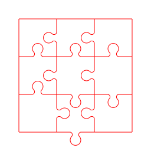
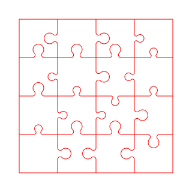
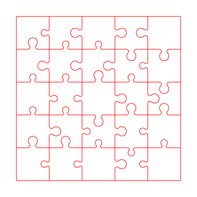
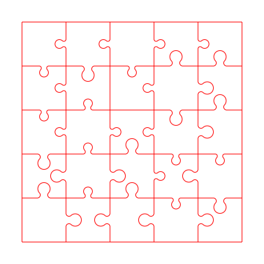

# Jigsaw generator

This is a small experiment where jigsaw puzzles are generated.

We focus on regular grids, where all pieces are squares of the same size.
A piece has 4 edges, selected from a small set of shapes, namely edge types.
By design, adjacent pieces must have complementary edge types.

Let us distinguish between two families of edge types:

 1. Symmetric edges, which are their own complement.
    Flat edges, typically used for borders, are the most common example.
    More generally, any shape that is invariant under central [point reflection](https://en.wikipedia.org/wiki/Point_reflection) (i.e. [centrally symmetric](https://en.wikipedia.org/wiki/Centrosymmetry)) are in this family.
 2. Asymmetric edges, which come in pairs.
    Traditionally, most asymmetric edges are designed in a male-female fashion, where one edge has some extrusion.

...


## Getting started

_Note: it is very likely that you will need to tweak `generate.cpp` to your need_

...

```
g++ -O3 -std=c++11 -o unique unique.cpp
g++ -O3 -std=c++11 -o generate generate.cpp
```

...

```
./unique
```

...

```
./generate > jigsaw.jl
python3 print.py
```


## Number of unique pieces

Regardless of whether a jigsaw puzzle can be solved, we can estimate how many different pieces can be uniquely created, given the number of edge types.
We distinguish between the following criteria:

 * All pieces, where rotated pieces are considered as distinct;
 * Canonical pieces, where rotated copies are deduplicated (i.e. how usual jigsaw puzzles are designed);
 * Canonical pieces with symmetrical pieces removed (to ensure uniqueness in the case of apictural jigsaws);
 * Canonical pieces with symmetrical pieces removed, but also where flipped copies are deduplicated (i.e. when there is no way to distinguish between front and back faces).

|edges|all|canonical|canonical&asymmetric|canonical&asymmetric&flipped|
|---|---|---|---|---|
|1|1|1|0|0|
|2|16|6|3|3|
|3|81|24|18|15|
|4|256|70|60|45|
|5|625|165|150|105|
|6|1296|336|315|210|
|7|2401|616|588|378|
|8|4096|1044|1008|630|
|9|6561|1665|1620|990|
|10|10000|2530|2475|1485|
|11|14641|3696|3630|2145|
|12|20736|5226|5148|3003|
|13|28561|7189|7098|4095|
|14|38416|9660|9555|5460|
|15|50625|12720|12600|7140|
|16|65536|16456|16320|9180|
|17|83521|20961|20808|11628|
|18|104976|26334|26163|14535|
|19|130321|32680|32490|17955|
|20|160000|40110|39900|21945|

Note that given any valid jigsaw, one can trivially generate additional variants by swapping swapping edge types (i.e. re-assign colors) or flip the whole board (i.e. axial symmetry).


## Examples

Using the provided code, we focus on jigsaw puzzles that have a single solution (excluding the rotation of the whole board).


### 3x3

A simple one, with exactly one solution:

```json
[[[1, 0, 0, 0], [1, 0, 2, 2], [0, 0, 2, 1]],
 [[1, 0, 0, 1], [1, 1, 2, 2], [0, 2, 2, 2]],
 [[2, 2, 0, 0], [1, 1, 1, 0], [0, 1, 2, 0]]]
```


With disambiguation pin at the bottom:

```json
[[[1, 0, 0, 1], [1, 0, 2, 1], [0, 0, 2, 1]],
 [[1, 2, 0, 1], [1, 2, 2, 2], [0, 2, 2, 2]],
 [[2, 2, 0, 0], [1, 1, 1, 2], [0, 1, 2, 0]]]
```




### 4x4

A simple one, with exactly one solution:

```json
[[[1, 0, 0, 1], [2, 0, 2, 1], [4, 0, 1, 1], [0, 0, 3, 3]],
 [[3, 2, 0, 1], [2, 2, 4, 3], [3, 2, 1, 4], [0, 4, 4, 3]],
 [[4, 2, 0, 3], [4, 4, 3, 1], [2, 3, 3, 1], [0, 4, 1, 2]],
 [[2, 4, 0, 0], [1, 2, 1, 0], [1, 2, 2, 0], [0, 1, 2, 0]]]
```



And another one:

```json
[[[1, 0, 0, 1], [1, 0, 2, 1], [1, 0, 2, 4], [0, 0, 2, 4]],
 [[2, 2, 0, 2], [1, 2, 1, 4], [3, 3, 2, 2], [0, 3, 4, 3]],
 [[4, 1, 0, 4], [3, 3, 3, 1], [2, 1, 4, 2], [0, 4, 1, 3]],
 [[3, 3, 0, 0], [4, 2, 4, 0], [3, 1, 3, 0], [0, 4, 4, 0]]]
```


### 5x5

A "simple" 5x5, with only one solution:

```json
[[[3, 0, 0, 1], [1, 0, 4, 3], [2, 0, 2, 3], [1, 0, 1, 2], [0, 0, 2, 2]],
 [[1, 2, 0, 3], [1, 4, 2, 3], [1, 4, 2, 1], [3, 1, 2, 3], [0, 1, 4, 2]],
 [[4, 4, 0, 3], [3, 4, 3, 3], [2, 2, 4, 2], [2, 4, 1, 1], [0, 1, 1, 1]],
 [[2, 4, 0, 1], [4, 4, 1, 1], [2, 1, 3, 3], [3, 2, 1, 4], [0, 2, 4, 3]],
 [[3, 2, 0, 0], [3, 2, 4, 0], [2, 4, 4, 0], [3, 3, 1, 0], [0, 4, 4, 0]]]
```



"Carefully chosen" inner border (the one at the top of the page), which has a unique solution, even when flipping pieces.
This is a perfect fit for single color pieces (e.g. transparent plastic).

```json
[[[3, 0, 0, 4], [3, 0, 4, 2], [4, 0, 4, 4], [4, 0, 3, 1], [0, 0, 3, 1]],
 [[3, 3, 0, 4], [0, 1, 4, 3], [3, 3, 0, 0], [2, 2, 4, 2], [0, 2, 1, 1]],
 [[3, 3, 0, 2], [4, 4, 4, 3], [3, 0, 3, 1], [2, 1, 4, 4], [0, 2, 1, 4]],
 [[1, 1, 0, 1], [2, 4, 2, 3], [4, 2, 1, 1], [1, 3, 3, 4], [0, 3, 2, 2]],
 [[2, 2, 0, 0], [1, 4, 1, 0], [1, 2, 2, 0], [2, 3, 2, 0], [0, 1, 1, 0]]]
```




## Side note about laser cutting

[PMMA](https://en.wikipedia.org/wiki/Poly(methyl_methacrylate)) (a.k.a. acrylic glass or plexiglass) is a good choice for laser cutter.
It seems that extruded (PMMA XT) sheets are of lesser quality when it comes to cutting, and stay transparent (which is an issue when engraving the surface is desired).
Therefore, casted acrylic (PMMA GS) is likely to be better.

Relevant links:

 * https://en.wikipedia.org/wiki/Cast_acrylic
 * https://edutechwiki.unige.ch/fr/Mat%C3%A9riaux_pour_la_d%C3%A9coupe_et_la_gravure_laser
 * https://www.youtube.com/watch?v=hiJft-LUAXI&ab_channel=TAPPlastics
 * https://www.amazon.de/-/en/Acrylic-methyl-methacrylate-Transparent-Crystal/dp/B08T9YVLZ2
 * https://www.youtube.com/watch?v=wtr2SWOBzf4&ab_channel=TrotecLaserUSA


## Scholar references

Even though these were not used in the final code, this may be of interest:

 * _Unique reconstruction threshold for random jigsaw puzzles_, Nenadov et al., 2016 ([link](https://arxiv.org/abs/1605.03043))
 * _Even 1 × n Edge-Matching and Jigsaw Puzzles are Really Hard_, Bosboom et al., 2016 ([link](https://arxiv.org/abs/1701.00146))
 * _No easy puzzles: Hardness results for jigsaw puzzles_, Brand, 2015 ([link](https://www.sciencedirect.com/science/article/pii/S0304397515001607))
 * _Solving Small-piece Jigsaw Puzzles by Growing Consensus_, Son et al., 2016 ([pdf](https://openaccess.thecvf.com/content_cvpr_2016/papers/Son_Solving_Small-Piece_Jigsaw_CVPR_2016_paper.pdf))
 * _Shotgun Assembly of Labeled Graphs_, Mossel and Ross, 2017 ([link](https://ieeexplore.ieee.org/abstract/document/8119552))
 * _Solving jigsaw puzzles by computer_, Wolfson et al., 1988 ([link](https://link.springer.com/article/10.1007%252FBF02186360))
 * _Automatic Reassembly of Three-Dimensional Jigsaw Puzzles_, Grim et al., 2016 ([link](https://www.worldscientific.com/doi/abs/10.1142/S0219467816500091))
 * _Automatic Solution of Jigsaw Puzzles_, Hoff and Olver, 2014 ([link](https://link.springer.com/article/10.1007/s10851-013-0454-3))
